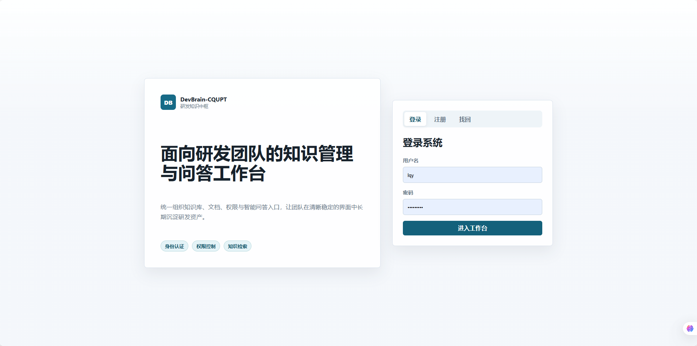
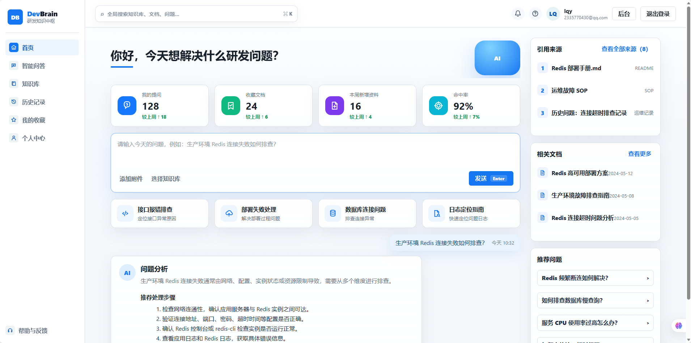
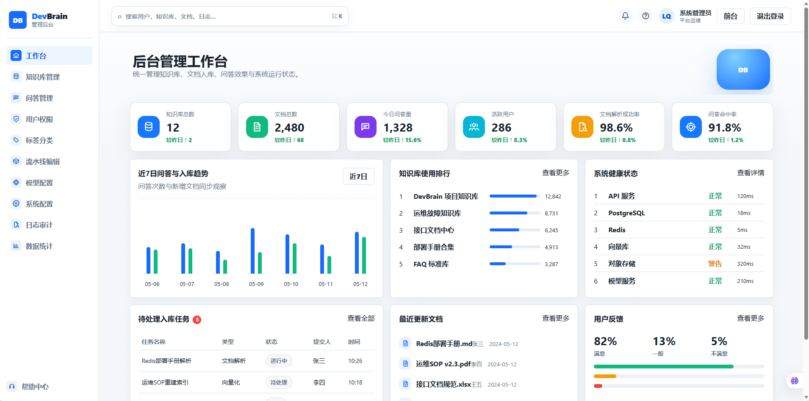
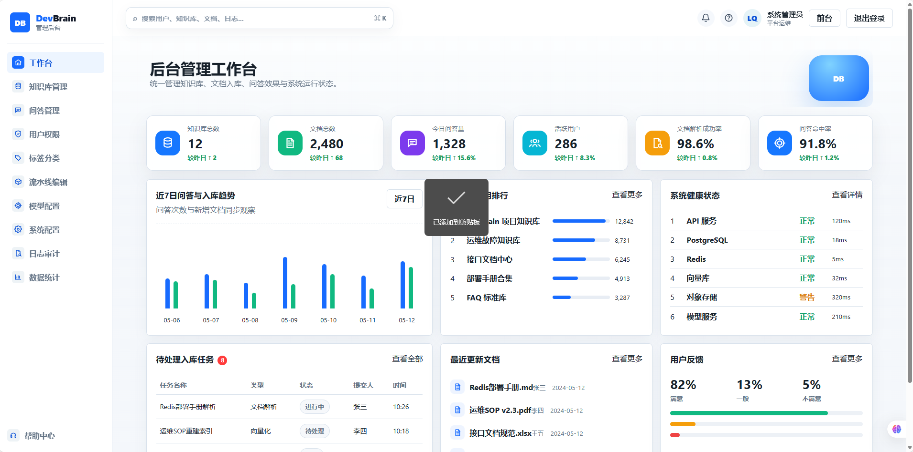
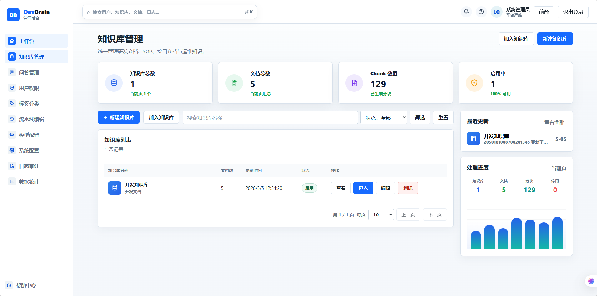
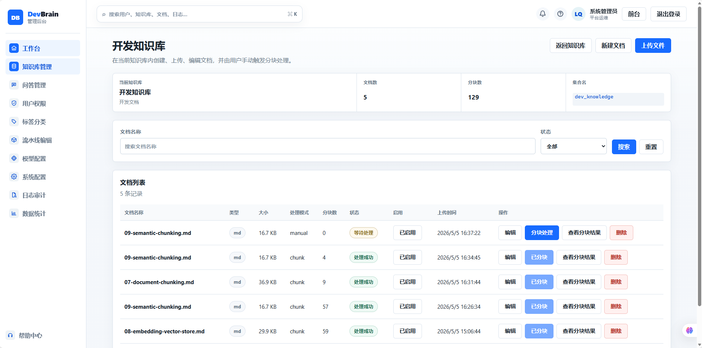
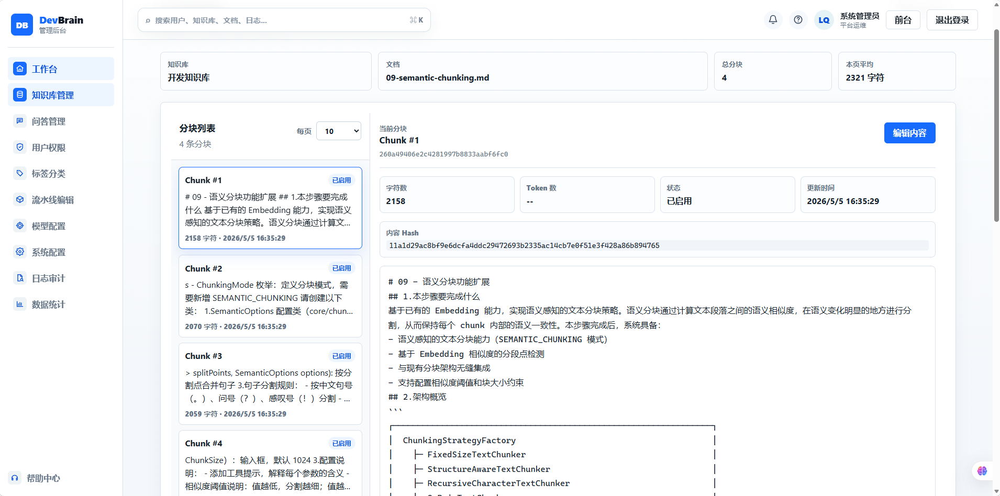
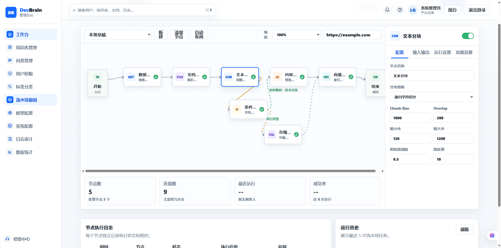
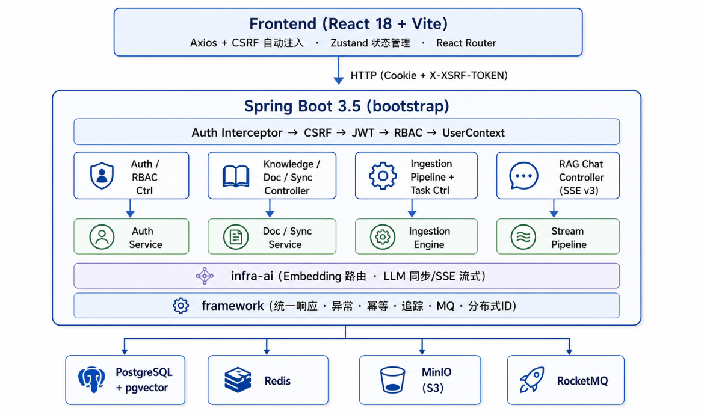

# ai-shopping-agent

<div align="center">

**打通「意图理解 → 智能咨询 → 决策辅助」核心路径的电商 AI 导购系统**

通过 RAG 知识库、流式交互与评测闭环，将电商导购从「信息搜索」推向「辅助决策」的代际跨越。


</div>

---

## 项目简介

ai-shopping-agent 是一套面向电商场景的 AI 智能导购系统，围绕「**意图理解 → 智能咨询 → 决策辅助**」三大核心环节构建完整技术链路。系统能够深度理解商品属性与用户购买意图，通过上传非结构化的商品详情与营销文档构建专属知识库，借助 RAG（检索增强生成）技术确保回复的专业性与准确性。

在交互层面，系统提供 SSE 流式对话体验，支持商品卡片实时渲染与多模态（文字/图片）输入解析。在质量保障层面，构建了端到端的评测与反馈闭环——通过对典型导购场景下的回答准确率、知识检索精度及多轮对话逻辑进行定量评估，反哺 Prompt 策略优化与知识库迭代，验证该工程方案在模拟商业场景下的技术可行性与交互质量。

后端采用 Java 17 + Spring Boot 3.5 多模块架构，前端采用 React 18 + Vite，向量存储基于 PostgreSQL + pgvector，并集成 Redis、MinIO、RocketMQ 等中间件。

## 项目意义

传统电商搜索更擅长「找商品」，但用户真正需要的是「做决策」——预算怎么取舍、参数是否匹配场景、不同商品为什么推荐、风险点在哪里。这些决策过程需要的不是更多信息，而是**有证据支撑、可追溯来源、可量化评测的智能辅助**。

ai-shopping-agent 将商品结构化数据、非结构化商品知识与多轮对话能力结合起来，构建了一条从意图识别到决策辅助的完整工程路径。它不仅是一个功能原型，更为电商导购从「关键词匹配」升级为「辅助决策」提供了可复制的工程实践参考。

## 功能亮点

### 意图理解

- **多模态输入解析：** 支持文字与图片混合输入，导购 Agent 能从用户描述、商品截图中提取购买意图。
- **需求澄清与追问：** 当用户意图模糊时，系统主动发起追问，通过多轮对话逐步收敛需求边界。
- **查询改写与子问题拆分：** 复杂咨询自动拆解为可检索的子问题，提升知识召回的覆盖率与精准度。

### 智能咨询

- **RAG 知识库底座：** 知识库、文档、分块、向量、同步历史统一管理，为商品推荐提供可追溯证据。
- **文档处理管线：** 支持 PDF、Office、Markdown、HTML 等格式，内置 Apache Tika 和 5 种智能分块策略。
- **可编排摄入 Pipeline：** `fetcher` / `parser` / `enhancer` / `chunker` / `enricher` / `indexer` 六类节点，支持任务日志追踪。
- **AI 多 Provider：** Embedding 和 LLM 支持按优先级路由与降级，当前接入 Ollama 与 SiliconFlow。
- **SSE 流式问答：** 支持多轮对话记忆、会话摘要、深度思考、引用证据展示和主动停止生成。

### 决策辅助

- **商品卡片流式推荐：** 导购 SSE 实时渲染商品卡片，支持意图识别、追问澄清、推荐排序、引用证据和回答增量输出。
- **智能导购闭环：** 商品、SKU、属性、媒体、文档绑定、导购会话、推荐快照和用户反馈统一管理。
- **证据可追溯：** 每条推荐附带知识来源引用，用户可验证推荐依据的可靠性。

### 质量评测与反馈闭环

- **评测集与批量运行：** 支持构建典型导购场景评测集，批量运行并生成指标报告。
- **多维定量评估：** 覆盖回答准确率、知识检索精度、多轮对话逻辑等核心指标。
- **反馈反哺迭代：** 用户反馈经审核后反哺 Prompt 策略优化与知识库内容迭代，形成持续改进闭环。

### 企业级基础设施

- **安全体系：** HttpOnly Cookie JWT、CSRF 双提交、RBAC 权限码、接口资源规则、登录风控、分布式限流。

## 界面预览

<table>
  <tr>
    <td width="50%"><strong>登录</strong><br></td>
    <td width="50%"><strong>首页</strong><br></td>
  </tr>
  <tr>
    <td width="50%"><strong>知识问答</strong><br></td>
    <td width="50%"><strong>后台管理</strong><br></td>
  </tr>
  <tr>
    <td width="50%"><strong>知识库管理</strong><br></td>
    <td width="50%"><strong>文档管理</strong><br></td>
  </tr>
  <tr>
    <td width="50%"><strong>分块查看</strong><br></td>
    <td width="50%"><strong>流水线编辑</strong><br></td>
  </tr>
</table>

## 技术架构



```text
React + Vite
    |
    | Cookie + X-XSRF-TOKEN
    v
Spring Boot bootstrap
    |-- Auth / RBAC / CSRF / UserContext
    |-- Commerce Product / Guide Session / Evaluation / Feedback
    |-- Knowledge Base / Document / Chunk / Sync
    |-- Ingestion Pipeline / Task / Node Log
    |-- RAG Chat / Retrieval / Conversation Memory
    |
    |-- framework: 统一响应、异常、幂等、追踪、MQ、分布式 ID
    |-- infra-ai: Embedding 路由、LLM 同步与流式调用
    |
    +-- PostgreSQL + pgvector
    +-- Redis
    +-- MinIO
    +-- RocketMQ
```

## 技术栈

| 方向 | 技术 |
| --- | --- |
| 后端 | Java 17、Spring Boot 3.5、MyBatis-Plus、Lombok |
| 前端 | React 18、Vite 6、TypeScript、Zustand、React Router、Axios |
| AI | Ollama、SiliconFlow、Embedding 多 Provider 路由、LLM 流式输出 |
| 数据 | PostgreSQL 16、pgvector、HNSW、Redis |
| 文档 | Apache Tika、Markdown 解析、网页抓取、飞书开放平台 |
| 存储与消息 | MinIO、AWS S3 SDK、RocketMQ、Redisson |
| 调度与可观测 | XXL-JOB（可选）、请求 ID、Trace、节点级任务日志 |

## 项目结构

```text
ai-shopping-agent/
├── bootstrap/          # Spring Boot 主应用，包含认证、知识库、文档、Pipeline、RAG 接口
├── framework/          # 通用框架能力：响应、异常、上下文、幂等、追踪、MQ、分布式 ID
├── infra-ai/           # AI 基础设施：EmbeddingService、LLMService、多 Provider 路由
├── mcp-server/         # MCP Server 骨架，默认端口 9099
├── frontend/           # React + Vite 前端应用
├── resources/
│   ├── database/       # schema.sql 与数据库说明
│   └── docker/         # PostgreSQL、Redis、MinIO、RocketMQ Compose
├── docs/               # 架构、功能和部署文档
└── pom.xml             # Maven 父工程
```

## 快速开始

### 环境要求

- JDK 17+
- Maven 3.8+
- Node.js 18+
- Docker 24+ / Docker Compose v2

### 1. 启动中间件

```powershell
docker compose -f resources/docker/postgres-pgvector.compose.yaml up -d
docker compose -f resources/docker/redis.compose.yaml up -d
docker compose -f resources/docker/minio.compose.yaml up -d
docker compose -f resources/docker/rocketmq.compose.yaml up -d
```

> Redis Compose 默认发布 `6379`，后端默认读取 `REDIS_PORT=6380`。本地启动后端前建议显式设置：`$env:REDIS_PORT="6379"`。

### 2. 启动后端

```powershell
$env:REDIS_PORT="6379"
mvn -q -DskipTests compile
mvn -pl bootstrap -am spring-boot:run
```

后端默认地址：`http://localhost:9090/api/devbrain`

### 3. 启动前端

```powershell
cd frontend
npm install
npm run dev
```

前端默认地址：`http://localhost:5173`

### 4. 登录系统

```text
用户名：admin
密码：password
```

> 该账号仅用于本地开发和演示，非本地环境必须修改默认密码与密钥。

## 常用命令

```powershell
# 后端
mvn -q -DskipTests compile
mvn -pl bootstrap -am test
mvn -pl bootstrap -am spring-boot:run

# 前端
cd frontend
npm run build
npm run dev

# 提交前检查
git diff --check
```

## API 概览

所有后端接口统一挂载在：

```text
/api/devbrain
```

核心接口分组：

- `/auth/**`：注册、登录、退出、CSRF、密码重置
- `/user/**`、`/users/**`、`/roles/**`、`/permissions/**`、`/resources/**`：用户与 RBAC 管理
- `/knowledge-base/**`、`/knowledge-documents/**`、`/documents/**`、`/chunks/**`：知识库、文档与分块管理
- `/sync-tasks/**`：在线文档同步与同步历史
- `/ingestion/**`：摄入流水线与任务执行
- `/rag/v3/chat`：通用 RAG SSE 流式问答
- `/rag/v3/stop`：停止指定 RAG 流式任务
- `/commerce/products/**`：商品目录、SKU、属性、媒体和文档绑定
- `/commerce/guide/**`：AI 导购流式对话、多模态图片和反馈
- `/commerce/evaluations/**`：导购评测集、运行记录和报告

## 文档入口

- [文档索引](docs/README.md)
- [功能总结](docs/feature-summary.md)
- [已实现功能清单](docs/implemented-features.md)
- [Framework 架构说明](docs/framework-architecture.md)
- [数据库与中间件搭建](docs/database-and-middleware-setup.md)
- [用户认证与权限](docs/user-auth-and-permission.md)
- [文档上传指南](docs/document-upload-guide.md)
- [文档分块策略](docs/document-chunking-guide.md)
- [在线文档同步](docs/document-sync-guide.md)
- [Embedding 配置指南](docs/embedding-configuration-guide.md)
- [Embedding 安全方案](docs/embedding-security-guide.md)
- [电商 AI 导购方案](docs/ecommerce-ai-shopping-guide-solution.md)
- [电商 AI 导购使用手册](docs/commerce-ai-guide-user-manual.md)
- [测试指南](docs/testing-guide.md)

## 配置提示

- 本地数据库 schema 位于 `resources/database/schema.sql`，PostgreSQL 容器首次启动时会自动初始化。
- `resources/docker/.env.example` 和 `application.yaml` 中的密钥仅作本地占位，生产环境必须通过环境变量或密钥管理器覆盖。
- 当前保留 `/api/devbrain`、`DEV_BRAIN_TOKEN`、`DEVBRAIN_*` 和 `devbrain.*` 等历史兼容前缀，避免破坏已有本地环境、Cookie、数据库和 Docker 配置。
- Embedding 模型维度必须与 `t_knowledge_vector.embedding` 列定义一致，切换模型前请确认 `RAG_DEFAULT_DIMENSION`。
- RAG 流式接口已接入限流、并发控制与幂等防护，相关配置位于 `rag.chat.*`。

## 安全说明

- JWT 存放在 HttpOnly `DEV_BRAIN_TOKEN` Cookie 中，不写入前端存储。
- 写接口使用 `XSRF-TOKEN` + `X-XSRF-TOKEN` 双提交校验。
- 接口权限由 `t_resource` 资源规则和 RBAC 权限码统一控制。
- 生产环境请开启 HTTPS，并设置 `DEVBRAIN_COOKIE_SECURE=true`。

## 已实现功能与模块

| 模块 | 已实现能力 |
| --- | --- |
| 认证与会话 | 用户注册、登录、退出、密码重置、个人资料维护、HttpOnly Cookie JWT、Redis 会话、CSRF 双提交防护。 |
| RBAC 权限 | 用户管理、角色管理、权限码管理、接口资源规则、角色权限分配、用户角色分配、请求级权限校验。 |
| 登录风控 | IP 级登录限流、账号失败次数锁定、密码 BCrypt 加密、登录审计。 |
| 知识库管理 | 知识库创建、分页查询、详情、更新、逻辑删除、`collection_name` 唯一校验、删除保护。 |
| 文档管理 | 本地文档上传、文档分页查询、启用/禁用、删除、文件扩展名校验、MIME 检测、文件名清理、上传并发限制。 |
| 文档解析 | Apache Tika 多格式解析、Markdown 专用解析、解析状态流转、失败重试、文本清理、异步解析任务。 |
| 文档分块 | 固定大小、递归字符、结构感知、问答对、表格感知 5 种分块策略；支持分块查询、编辑、删除和批量启用/禁用。 |
| 向量与检索 | pgvector 向量存储、HNSW 索引、余弦相似度 Top-K 检索、分块变更后自动同步向量。 |
| Embedding 服务 | Ollama / SiliconFlow 多 Provider 路由、候选模型优先级降级、向量维度校验、批量 Embedding。 |
| 在线同步 | 飞书文档同步、URL 抓取同步、内容哈希比对、手动触发、定时调度、同步历史和同步概览。 |
| 摄入 Pipeline | Pipeline 定义 CRUD、6 类节点注册、JSON 来源任务、文件上传任务、节点级状态与日志记录。 |
| RAG 问答 | SSE 流式问答、多轮对话记忆、会话摘要、查询改写、子问题拆分、意图识别、深度思考、停止生成。 |
| AI 导购 | 商品候选召回、需求澄清、证据检索、推荐排序、商品卡片流式输出、导购会话状态持久化。 |
| 商品管理 | 商品、SKU、属性、媒体、标签、商品文档绑定和商品属性抽取。 |
| 评测反馈 | 导购评测集、评测用例、批量运行、指标报告、用户反馈和反馈审核。 |
| 问答防护 | 聊天限流、并发队列控制、短窗口幂等提交、防重复请求、防资源占用。 |
| 前端应用 | 登录注册、用户工作台、后台管理、知识库管理、文档管理、分块查看、同步任务、Pipeline 编排、RAG 对话页面。 |
| 基础框架 | 统一响应、全局异常、请求 ID、用户上下文、MyBatis-Plus 自动填充、幂等、追踪、Redis Key 序列化、RocketMQ 适配、分布式 ID。 |
| MCP Server | 独立 Spring Boot 模块骨架，默认端口 `9099`，预留后续 MCP 工具扩展入口。 |

## 许可证

本项目由 liuqiyang 个人开发并开源。
